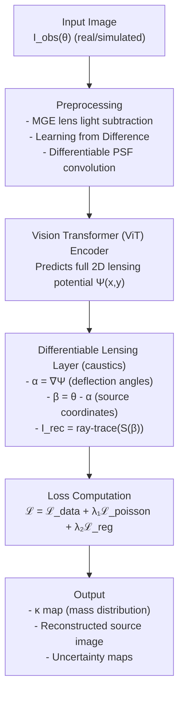

# DI-PINN: Differentiable Inverse Physics-Informed Neural Network
### Reconstructing dark matter mass maps from real strong lensing images

---

## The Core Idea

Strong gravitational lensing is one of the most direct ways we have to map dark matter. For a long time, DeepLense has been pushing machine learning forward in this space. They went from basic CNN classification back in 2020 all the way to LensPINN in 2024. LensPINN is incredible—it embedded the actual lens equation into the network to classify dark matter substructure and hit 99.6% accuracy on simulated data. But that’s the catch: it only works on simulations, and it only tells you a class label, like "this is an axion" or "this is cold dark matter."

Real observatory data from places like HSC, HST, or LSST is a completely different beast. You have noise, telescope blur (PSF), the blinding light of the foreground galaxy itself, and a massive domain gap between perfect simulations and messy reality. These classification models just break when you show them real data. On top of that, knowing the class label doesn't actually tell you where a subhalo is, how heavy it is, or how many there are. If we want real insight into these lensing systems and their sub-structures, we can't just classify them. We have to reconstruct the mass distribution itself.

That's where the convergence field, κ(x,y), comes in. It's the projected mass density of the lens. If we can reconstruct a full κ map, we can:
- Find subhalos by looking for peaks in κ.
- Measure their masses by integrating around those peaks.
- Count the subhalos.
- Compare actual dark matter morphologies.
- Treat classification, regression, and anomaly detection as straightforward post-processing steps on the map we already built.

So, DI-PINN is built to do exactly that. We learn to reconstruct κ maps directly from real lensing images. To do this, we embed a fixed, differentiable physics engine called `caustics` right into the network. That handles the physics constraint. To handle the messy real-world data, we bring in Multi-Gaussian Expansion (MGE) to subtract the foreground galaxy light, Physics-Informed AdaMatch to bridge the gap between simulation and reality, and Bayesian Deep Ensembles to actually give us confidence intervals and tell us where we can trust our predictions.

## Expanding Beyond Previous Methods

If we look at what was accomplished previously (like LensPINN in 2024) and what DI-PINN is built to solve, the differences are stark:

| Core Problem | What Has Been Done (LensPINN 2024) | DI-PINN (Our Approach) |
| --- | --- | --- |
| **Handling Real Datasets & Noise** | Trained and tested exclusively on simulated (Model II) data. | Designed for HSC/HST/LSST data by using MGE light subtraction and PI-AdaMatch domain adaptation to handle real-world noise. |
| **Observational Constraints** | Assumed lens light was already removed; no real-data training. | Fine-tuned directly on real cutouts using physics-informed pseudo-labels. |
| **Physics-Informed Architecture** | Embedded the lens equation mathematically as a scalar Einstein radius. | Predicts the entire 2D field, enforcing the Poisson equation dynamically via `caustics`. |
| **Multiple Tasks (Classification, Regression, etc.)** | Output was purely classification. | By reconstructing the entire κ map, we can perform classification, regression, and anomaly detection entirely as post-processing. |
| **Wide Variety of Galaxy Data** | Validated only on simulations. | Validated on HSC, HST, and Model IV (real-galaxy backgrounds). |
| **Lensing System Insights** | A single output class label. | Outputs precise κ maps, spatial subhalo locations, reliable mass estimates, and uncertainty contours. |
| **Sub-Structure Information** | None. | Subhalo candidates, discrete mass numbers, and the mass power spectrum. |

## The Key Components

Every piece of this framework is chosen to solve a specific, practical problem. All of these concepts exist and are validated in literature—we are just bringing them together to solve the full inverse problem.

| Component | Purpose | Why it's critical here |
| --- | --- | --- |
| **`caustics`** | Differentiable ray-tracing | It forces the networks to obey the lens equation exactly instead of as a soft, generic loss approximation. Gradients flow naturally through the physics. |
| **Multi-Gaussian Expansion (MGE)** | Foreground light removal | Real galaxy light often completely drowns the faint lensed arcs we care about. MGE isolates them mathematically. |
| **PI-AdaMatch** | Domain adaptation (sim to real) | Guarantees that the pseudo-labels generated for real images actually satisfy gravity, like ensuring Einstein rings are closed. |
| **Bayesian Deep Ensembles** | Uncertainty quantification | Gives us a pixel-by-pixel confidence interval. It essentially tells us exactly where we can trust the map and where we can't. |

## How the Architecture Flows

The architecture is built so the signal flows cleanly from raw input down to a physically constrained mass map.

## The Underlying Physics

There are a few key equations that the network is forced to obey. By baking these in, we stop the network from hallucinating physically impossible mass distributions.

| Equation | Mathematical Form | What it Enforces |
| --- | --- | --- |
| **Poisson** | ∇²Ψ = 2κ | The fundamental relationship tying mass to gravitational potential. |
| **Deflection** | α = ∇Ψ | The potential gradient dictates how the light actually bends. |
| **Lens Equation** | β = θ - α(θ) | The geometric mapping from the image plane back to the source plane. |
| **Data Fidelity** | ℒ_data = ‖I_obs - I_rec‖² | The image we reconstruct through ray-tracing must perfectly match what the telescope observed. |
| **Physics Consistency** | ℒ_poisson = ‖∇²Ψ - 2κ‖² | The network's internal representation has to satisfy the strict laws of gravity. |

## Anticipated Challenges and How We Solve Them

When you try to run an inverse physics model on real space data, things go wrong. Here is how we accounted for the major roadblocks:

| The Problem | How We Handle It |
| --- | --- |
| **MGE itself isn't differentiable.** | We run it as a one-off pre-processing step for each image. The lens light isn't part of the dark matter inference anyway, so taking it out of the gradient graph is totally fine. |
| **Predicting a full 2D potential field can be unstable.** | We're using a U-Net style decoder with skip connections to naturally encourage smoothness. We also apply a Laplacian regularization to strictly penalize unphysical wave oscillations in the potential. |
| **Memory bottlenecks during ray-tracing over full image grids.** | We rely on mixed-precision training (float16) and heavy gradient checkpointing. The `caustics` backend is deeply optimized for GPUs. If needed, we train downsampled 64x64 patches early on. |
| **PI-AdaMatch producing garbage pseudo-labels at the start.** | We don't touch real data immediately. We do a pure simulation warm-up until the model learns the physics. Then we gradually introduce the real dataset, dropping any pseudo-labels that have a reconstruction error above our safety threshold. |
| **Getting real uncertainty calibration.** | We fall back to the industry standard of training a 5-model deep ensemble. If running 5 identical models is too heavy, we swap to standard Monte Carlo dropout. |
| **You can never have a ground truth κ map for real images.** | We validate our results by comparing them against Lenstronomy MCMC fits on heavily studied benchmark lenses (like those from SLACS). We perform standard injection-recovery tests to verify we can consistently spot synthetic subhalos. |

## What Has Already Been Built (The MVC)

This isn't just a purely theoretical idea on paper. The core minimum viable code (MVC) is already built, tested, and working.

| Component | Status | Details |
| --- | --- | --- |
| **Synthetic Data Pipeline** | Complete | We can generate SIS halos and random subhalos on the fly. |
| **U-Net Baseline Model** | Complete | A fully functioning encoder-decoder architecture with skip-connections. |
| **Physics Modules** | Complete | The integrated Poisson solver and ray-tracing pipeline is built and unit-tested. |
| **Training Pipeline** | Complete | Supervised looping with MSE loss, live checkpointing, and dynamic plotting. |
| **Trained Weights** | Complete | `mvc_unet.pth` holds the baseline trained model capable of successful κ reconstruction. |

This MVC proved that the data pipeline, the loss structure, and the training loop fundamentally work for reconstructing mass maps from simulated lensing. The remainder of DI-PINN is about extending this rock-solid base to handle the intense noise, foreground glare, and underlying uncertainty of actual telescope observations.

## Conclusion

DI-PINN is exactly what happens when you decide that just classifying dark matter isn't enough anymore. Moving from simulated classification blocks to actual, probabilistic mass reconstruction on real observational data is a huge leap, but an incredibly necessary one. We need insight—where the subhalos actually are, how massive they are, and exactly how confident we are in that guess.

By bringing together differentiable physics, modern domain adaptation, and Bayesian uncertainty bounds, we stop throwing a black box at the sky and start enforcing the actual laws of gravity in our networks.
