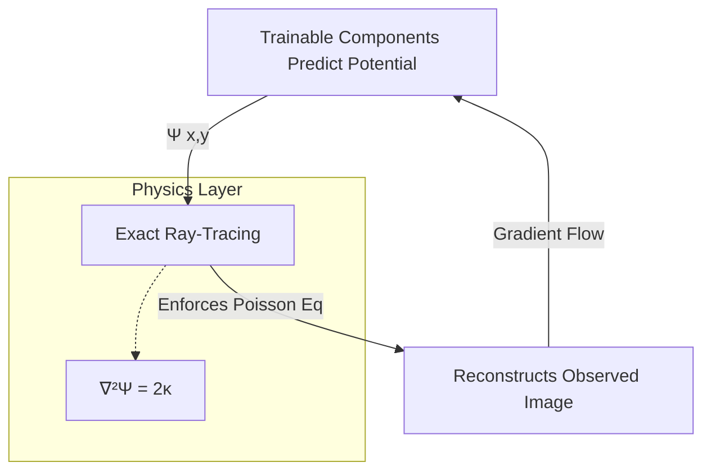
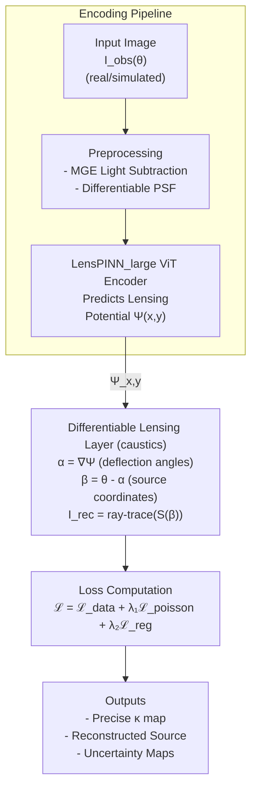

# DI-PINN: Differentiable Inverse Physics-Informed Neural Network
### Reconstructing dark matter mass maps from real strong lensing images

---

## Introduction
### Sequential Developments

Previous studies, such as the 2020 work *Deep Learning the Morphology of Dark Matter Substructure*, established that convolutional neural networks could reliably distinguish between different types of dark matter—such as CDM subhalos versus axion vortices—in simulated strong lensing images. Treating this as a classification problem was identified as an "intermediate step" before the ultimate goal: determining the position, mass, and other physical properties of individual substructures.

The 2021 follow-up, *Decoding Dark Matter Substructure without Supervision*, further demonstrated that unsupervised models, particularly Adversarial Autoencoders, could serve as highly effective anomaly detectors. Crucially, the reconstruction MSE loss was shown to inherently encode information about the location of substructures, pointing toward the possibility of "using this data to invert the lens equation to produce the distribution of substructure mass on the lensing plane."

Analyzing these developments sequentially reveals a clear methodological trajectory. Successive models move progressively toward a common destination: theory-agnostic, spatial mass maps of dark matter substructures in real telescope images. While the physical models are well-understood, the ML architectures are proven on simulations, and observational datasets are imminent with the Vera C. Rubin Observatory (LSST) and Euclid, the framework to synthesize these breakthroughs for application on complex, real-world observational data remains to be established.

### DI-PINN

This proposal introduces DI-PINN (Differentiable Inverse Physics-Informed Neural Network). The DI-PINN framework integrates the `caustics` lensing library directly into the neural network's computation graph. Unlike traditional PINNs that might only penalize residuals based on a static equation, `caustics` provides a fully differentiable simulator (built on PyTorch) that allows gradients to flow from the reconstructed image back through the physical lensing equations to update the network parameters.

**Core Architecture Components:**

- **Vision Transformer (ViT) Backbone:** A LensPINN_large architecture (adapting EfficientNet or ViT encoders) serves as the primary feature extractor. It takes the observed lensed image as input and predicts the macroscopic mass parameters (Einstein radius $\theta_E$, shear $\gamma$, ellipticity $e$) and the pixelated source light profile.
- **Differentiable Lensing Layer:** The predicted parameters are fed into the `caustics.Lens` and `caustics.Source` modules. This layer performs ray-tracing operations $\beta = \theta - \alpha(\theta)$ to reconstruct the lensed image from the predicted source and mass model.
- **Physics-Informed Consistency Loss:** The model is trained to minimize the Lensing Reconstruction Loss—the difference between the observed image and the image re-lensed by the differentiable layer. This ensures that every prediction satisfies the gravitational lensing equation.
- **Real-Data Adaptation Modules:** To handle the complexities of real skies, the framework incorporates a Multi-Gaussian Expansion (MGE) module for automated lens-light subtraction, and Physics-Informed AdaMatch (PI-AdaMatch) for robust domain adaptation. The ultimate goal is to progress from labeling the dark matter to mapping and quantifying it.

#### Core Architecture Flow

The core architecture follows the progression from black-box to physics-informed modeling. Instead of learning a direct mapping from images to target labels, a differentiable physics engine (`caustics`) is embedded as a fixed, deterministic layer within the network.

1. **Prediction:** The trainable components learn to predict the lensing potential $\Psi(x,y)$.
2. **Ray-Tracing & Physics Enforcement:** The physics layer performs exact ray-tracing, strictly enforcing the Poisson equation $\nabla^2\Psi = 2\kappa$.
3. **Reconstruction & Optimization:** The observed image is reconstructed. Consequently, gradients flow through this entire physical pipeline, ensuring that every weight update iteratively drives the predictions toward solutions that satisfy Einstein's field equations.

## Architecture Data Flow

The architecture is explicitly designed so the signal flows from raw input down to a physically constrained mass map.

## Key Components

This framework represents a  shift from "black-box prediction" to "physics-driven inverse modeling." 

| Component / Feature | Previous Work (LensPINN 2024) | DI-PINN (This Architecture) | Why it's critical here |
| --- | --- | --- | --- |
| **Physics Engine** | Static Analytical Formula (limited to SIS profiles). | Differentiable Simulator (`caustics`) handling complex generic profiles. | Provides a fully differentiable simulator where gradients flow from the reconstructed image back through the physical lensing equations to update network parameters. |
| **Input Data** | Trained and tested exclusively on Simulated Model II data. | Explicitly designed for real HSC/HST/LSST observations + Sim. | Enables the model to bridge the gap between idealized models and real telescope findings. |
| **Foreground Light** | Assumed negligible or already removed. | Active lens light removal via Multi-Gaussian Expansion (MGE). | Real galaxy light drowns the faint lensed arcs. MGE models and isolates them mathematically. |
| **Scientific Value** | Outputs a categorical class label (e.g., "Axion" vs "CDM"). | Mass parameters, reconstructed source image, and the power spectrum. | Moves beyond categories to actual scalable physical parameters. |
| **Confidence Level** | Deterministic (Softmax). | Probabilistic (Bayesian Deep Ensembles) providing uncertainty maps. | Calculates the pixel-wise variance of source reconstructions. High-variance regions serve as candidate locations for dark matter subhalos. |
| **Domain Adaptation** | None. | PI-AdaMatch. | Enforces a *Self-Consistent Lensing Loss* on pseudo-labels for real images, ensuring predictions satisfy gravity during Domain Adaptation. |

## The Physics

There are a few key equations that the network is forced to obey. By baking these in via the `caustics` library, the network is prevented from hallucinating physically impossible mass distributions.

| Equation | Mathematical Form | What it Enforces |
| --- | --- | --- |
| **Poisson** | ∇²Ψ = 2κ | The fundamental relationship tying mass to gravitational potential. |
| **Deflection** | α = ∇Ψ | The potential gradient dictates how the light actually bends. |
| **Lens Equation** | β = θ - α(θ) | The geometric ray-tracing mapping from the image plane back to the source plane. |
| **Data Fidelity** | ℒ_{data} = ‖I_{obs} - I_{rec}‖² | The image reconstructed through the forward pass must match what the telescope observed. |
| **Physics Consistency** | ℒ_{poisson} = ‖∇²Ψ - 2κ‖² | The network's internal representation strictly satisfies the laws of gravity. |

## Anticipated Challenges and Mitigation Strategies

Applying inverse physics models to real space data introduces several roadblocks. Here is how I constructed the pipeline to mitigate them:

| Roadblock | Mitigation Strategy |
| --- | --- |
| **MGE itself isn't differentiable.** | It is run as an automated one-off pre-processing step using `mge_fit`. Since lens light isn't part of the dark matter inference, treating it outside the gradient graph works perfectly. |
| **Predicting a full 2D potential field can be unstable.** | The U-Net style decoder includes skip connections to naturally encourage smoothness, alongside a Laplacian regularization term to penalize unphysical wave oscillations. |
| **Memory bottlenecks during ray-tracing over full grids.** | Handled via mixed-precision training (float16) and gradient checkpointing. The `caustics` backend is highly GPU-optimized to keep memory overhead manageable. |
| **PI-AdaMatch producing low-quality pseudo-labels early on.** | Training begins with a pure simulation warm-up. Real data is gradually introduced, and pseudo-labels are strictly filtered out if their reconstruction error is above a designated threshold. |
| **Securing accurate uncertainty calibration.** | A deep ensemble of independently initialized models provides epistemic uncertainty. The pixel-wise variance of these models explicitly highlights regions where the prediction is unreliable. |
| **Lack of a ground truth κ map for real observations.** | Model validation is performed by comparing predictions against Lenstronomy MCMC fits on "Gold Standard" lenses. Injection-recovery tests confirm the reliable detection of synthetic subhalos. |

